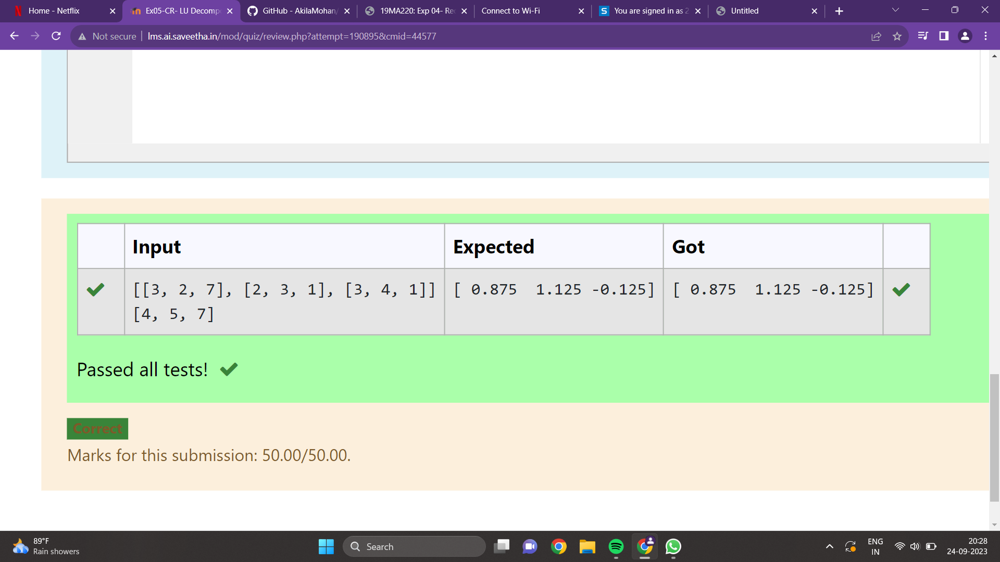

# LU Decomposition 
## DATE:13.09.2023
## AIM:
To write a program to find the LU Decomposition of a matrix.
## Equipments Required:
1. Hardware – PCs
2. Anaconda – Python 3.7 Installation / Moodle-Code Runner
## Algorithm
1. Define the package as scipy.linalg import lu.
2. Get input from user and print L and U matrix by 'print'.
3. Define a package as "from scipy.linalg import lu_factor, lu_solve" and create the variable as 'X' include the package in that variable.
4. print the variable 'X'
## Program:
(i) To find the L and U matrix
```
Program to find the L and U matrix.

import numpy as np
from scipy.linalg import lu
A=np.array(eval(input()))
P,L,U=lu(A)
print(L)
print(U)

Developed by:PAVANA G 
RegisterNumber: 212222230105

```
(ii) To find the LU Decomposition of a matrix
```
Program to find the LU Decomposition of a matrix.

import numpy as np
from scipy.linalg import lu_factor,lu_solve
A=eval(input())
B=eval(input())
lu,piv=lu_factor(A)
x=lu_solve((lu,piv),B)
print(x)

Developed by:PAVANA G 
RegisterNumber: 212222230105
```
## Output:
## output  for finding  the L and U matrix.

## output for finding the LU Decomposition of a matrix

## Result:
Thus the program to find the LU Decomposition of a matrix is written and verified using python programming.

